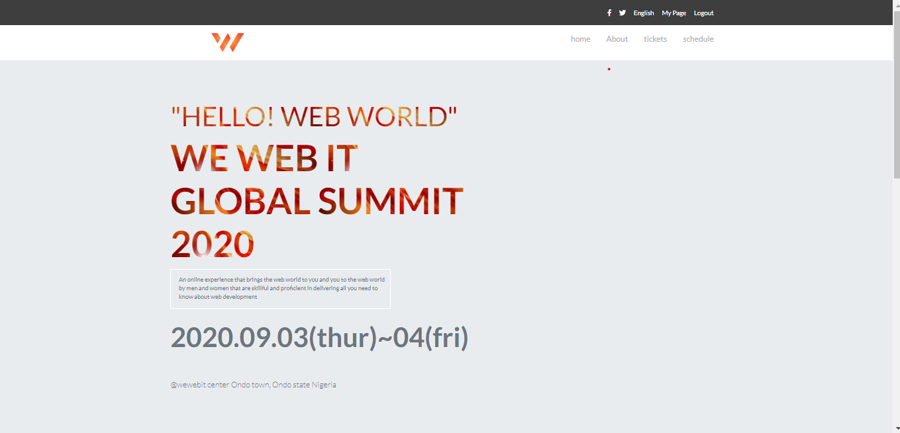

# capstone-project

This project focuses on building a responsive conference website for an online web-training.
The main goal of the project is to solidify my understanding on HTML5/CSS3 and Twitter Bootstrap in creating a responsive website.

The wewebit website has three different pages that are responsive on the two major screen sizes; Mobile and Desktop screens.

The pages below were covered in this project:
- Home page
- About page
- Tickets page

## Built With

- HTML/CSS3,
- Twitter Bootstrap,
- Font Awesome

## Live Demo

[Live Demo Link](https://rawcdn.githack.com/Adewunmi97/capstone-project/537c7f969ceeadeeea70f5766d3f8c53e65b874b/index.html)

## Getting Started

Follow the instructions below to get a working copy of this clone.

### Prerequisites
A working knowledge of the technologies used: HTML, CSS3 and Bootstrap

### Setup
Clone this repo to your local machine
`git clone https://github.com/Adewunmi97/capstone-project.git`

### Install
Install the Webhint and Stylelint linters

### Usage
Go through the code, study and edit as desired

### Deployment
Feel free to deploy using any medium of choice

## Authors

👤 **Adewunmi**

- Github: [@Adewunmi97](https://github.com/Adewunmi97)

## 🤝 Contributing

Contributions, issues and feature requests are welcome!

Feel free to check the [issues page](issues/).

## Show your support

Give a ⭐️ if you like this project!

## 📝 License

This project is [MIT](lic.url) licensed.
